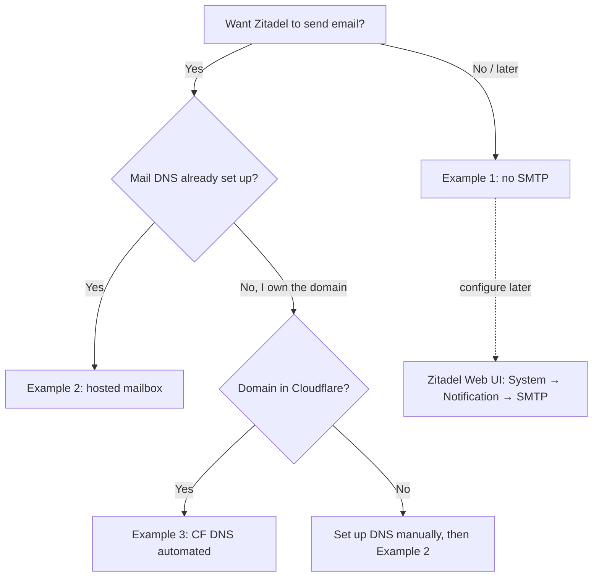

# Zitadel

Open-source identity management platform providing OIDC/OAuth2 authentication. Runs as a Docker Compose service with Traefik reverse proxy.

## Prerequisites

- Stacktype: `postgres`, `oidc` — shares database password with PostgreSQL stack, provides OIDC credentials to other apps
- Dependency: `postgres` must be installed in the same stack

## Installation

### Key Parameters

| Parameter | Default | Description |
|-----------|---------|-------------|
| `hostname` | `zitadel` | Container hostname |
| `ZITADEL_EXTERNALDOMAIN` | (= hostname) | Public domain name for URLs and OIDC config |

### Bootstrap Process

On first start, Zitadel runs `start-from-init` which:

1. Creates the database schema in PostgreSQL
2. Creates a default admin user (`admin` with auto-generated password)
3. Generates Personal Access Tokens (PATs) for API access at `/bootstrap/`
4. Sets up the oci-lxc-deployer OIDC project with roles and client credentials

The bootstrap credentials are stored in `/bootstrap/deployer-oidc.json` inside the container and are used by the `addon-oidc` addon to configure other applications.

### What Gets Created Automatically

- **Admin user** — username `admin`, password is `ZITADEL_ADMIN_PASSWORD` (from the `oidc` stack) + `!Aa1` suffix. Retrieve the password from **Stacks > oidc** in the deployer web UI
- **OIDC Project** — "oci-lxc-deployer" with role assertion enabled
- **Service accounts** — `admin-client` and `login-client` with PATs
- **Roles and OIDC apps** — Created per-application when `addon-oidc` is enabled on other apps

### What You Must Do Manually

- Create regular users in the Zitadel web interface
- Assign project roles to users (e.g. `admin` role for deployer access)

## Architecture

```
Traefik (port 8080/1443)
  -> /ui/v2/login/*  -> zitadel-login (Next.js UI)
  -> /*              -> zitadel-api (Go backend, h2c)
```

Traefik rewrites the Host header to `ZITADEL_EXTERNALDOMAIN` so Zitadel accepts requests regardless of the external hostname used to access it (e.g. via port forwarding).

## SSL

Zitadel uses `ssl_mode: native`. When SSL is enabled:

- Traefik switches from HTTP to HTTPS with TLS termination
- HTTP requests are redirected to HTTPS
- `ZITADEL_EXTERNALSECURE` is set to `true`
- Default HTTPS port: 1443

## Startup Order

`startup_order: 20` — starts after PostgreSQL (order 10).

## Ports

| Port | Protocol | Description |
|------|----------|-------------|
| 8080 | HTTP | Traefik entrypoint (redirects to HTTPS when SSL enabled) |
| 1443 | HTTPS | Traefik HTTPS entrypoint (when SSL enabled) |

## Email notifications (SMTP)

Zitadel sends email for password reset, user invitation, email verification, and
MFA notifications. Out of the box no SMTP is configured — these flows fail
silently with `could not create email channel — Errors.SMTPConfig.NotFound` in
the `zitadel-api` log.

You can configure SMTP **either** at deploy time (via stack + app parameters,
which is what this document describes) **or** later in Zitadel's web UI
(`System → Notification → SMTP`). The web UI route always works and doesn't
require a redeploy — use it if you want to experiment or change providers
after the initial install. The deploy-time route is useful when you want SMTP
configured automatically on every (re)install without manual clicks.

> **Important warning:** Zitadel's UI may report "successfully sent" when the
> SMTP handshake succeeded, even if the recipient never receives the mail
> (e.g. the provider silently dropped it because the sender address isn't
> authorized). **Always test with a real external recipient** after setup,
> don't trust the UI-level success message.

### Overview — which option fits?

| You have... | Option | DNS change? | Manual provider setup? | Details |
|---|---|---|---|---|
| …no need for email yet | [No email](#example-1--no-email-default) | — | — | Deploy without SMTP, configure later in the Zitadel web UI |
| …an existing hosted mailbox, DNS already correct | [Hosted mailbox](#example-2--existing-hosted-mailbox-no-dns-change) | No | Provider-dependent | Fill SMTP entries in the `oidc` stack, deploy |
| …your own domain in Cloudflare, no mail DNS yet | [Own domain, CF DNS automated](#example-3--own-mail-domain-with-cloudflare-dns-automation) | Yes, automated | Yes, once | Add `CF_TOKEN` stack and `smtp_own_domain` parameters, DNS records auto-created |
| …mailbox.org account | [Mailbox.org specifics](#example-4--mailboxorg-specifics) | Depends | Alternate sender + verification | Concrete values for the mailbox.org case |



All options use the same storage: the **`oidc` stack** holds SMTP_HOST /
SMTP_PORT / SMTP_USER / SMTP_SENDER / SMTP_PASSWORD. The Zitadel app's
**parameters** (`smtp_own_domain`, `smtp_mail_domain`, `smtp_mx_target`,
`smtp_spf_value`) only matter for option 3.

### Example 1 — No email (default)

Leave the SMTP fields in the `oidc` stack empty:

| `oidc` stack entry | Value |
|---|---|
| `SMTP_HOST` | *(empty)* |

Zitadel deploys without SMTP. You can always add SMTP later through the
Zitadel web UI under **System → Notification → SMTP**, without redeploying
the container.

> **Warning — debugging is painful without email.** Many Zitadel flows
> silently depend on email delivery and fail invisibly without it:
>
> - **Password reset** — the user requests a reset, Zitadel "sends" a link,
>   nothing arrives, the user is stuck. No error is shown.
> - **User invitations** — invited users never get their invitation mail.
> - **Email verification** on new accounts — users can't verify themselves.
> - **MFA setup / recovery codes** — some flows deliver codes by email.
>
> In this mode you have to perform these actions **manually as admin**:
> create users directly with `emailVerified=true`, set their passwords
> without reset, and communicate credentials out-of-band (chat, paper,
> other mail system). This is fine for a single-admin test install but
> quickly becomes impractical once you add a second user.
>
> If you're just trying Zitadel out, this mode is OK. If you plan to use it
> for real, set up SMTP first — it saves hours of "why isn't this working"
> debugging where the answer is always "because the mail never arrived".

### Example 2 — Existing hosted mailbox (no DNS change)

You already own a mailbox like `admin@example.com` at a hosted provider
(mailbox.org, Fastmail, Google Workspace, …) and the MX/SPF DNS records for
`example.com` are **already** pointing at that provider. You only want Zitadel
to send mail through it.

Fill the `oidc` stack:

| Entry | Example |
|---|---|
| `SMTP_HOST` | `smtp.mailbox.org` |
| `SMTP_PORT` | `587` |
| `SMTP_USER` | `admin@example.com` |
| `SMTP_SENDER` | `admin@example.com` |
| `SMTP_PASSWORD` | *(your provider password or app-specific token)* |

In the Zitadel app parameters:

| Parameter | Value |
|---|---|
| `smtp_own_domain` | `false` |

Deploy. Zitadel reads the env vars at init, stores them in its DB, and starts
sending email through the hosted provider. Nothing touches DNS.

> Many providers require a **provider-specific setup step** first:
> mailbox.org wants the sender added as an "alternate sender" and verified by
> email; Gmail wants an app-specific password; Google Workspace wants the
> sender added as a verified user. Consult your provider's documentation
> before filling `SMTP_HOST`.

### Example 3 — Own mail domain with Cloudflare DNS automation

You own a domain like `example.com` hosted in Cloudflare and you want this
deploy to **automatically create the MX and SPF DNS records** pointing at your
mail provider, so email from `admin@example.com` is deliverable.

> **Chicken-and-egg note:** You can **not** set up the alternate sender at
> your mail provider first — at providers like mailbox.org the verification
> email can only be delivered *after* the MX record for your domain is
> pointing at them. So the order is: **deploy first** (creates DNS), **then**
> add the alternate sender and click the verification link (which now
> arrives), **then** test sending. Do not try to configure the provider
> before the deploy.

Prerequisites:

- A Cloudflare stack with `CF_TOKEN` (same token you use for ACME DNS-01)
- The Zitadel `oidc` stack filled with the SMTP values (host, port, user,
  sender, password) from your provider's documentation — you can fill them
  now, Zitadel will retry sending until the provider actually accepts.

**Step 1 — Deploy:** Fill the `oidc` stack exactly as in Example 2, **plus**
select the cloudflare stack in the app. Then set the Zitadel app parameters:

| Parameter | Value |
|---|---|
| `smtp_own_domain` | `true` |
| `smtp_mail_domain` | `example.com` |
| `smtp_mx_target` | `mxext1.mailbox.org` *(provider-specific)* |
| `smtp_spf_value` | `v=spf1 include:mailbox.org ~all` *(provider-specific)* |

Deploy. The `385-post-configure-mail-dns` template reads `CF_TOKEN` from the
cloudflare stack and calls the Cloudflare API to upsert:

- **MX** record: `example.com` → `mxext1.mailbox.org` (priority 10)
- **TXT** record: `example.com` → `v=spf1 include:mailbox.org ~all`

The script is **idempotent** — if the records already exist with the same
values, it updates them instead of creating duplicates. You can re-run the
deploy safely.

**Step 2 — Verify DNS is live** (optional but recommended):

```sh
dig +short MX example.com
dig +short TXT example.com
```

DNS propagation over Cloudflare is typically seconds.

**Step 3 — Provider alternate sender:** Now that MX points at your provider,
the provider's verification mail to `admin@example.com` can actually arrive.
Log in to the provider (e.g. mailbox.org) and add the alternate sender, then
click the verification link the provider emails you. Zitadel at this point is
already configured and will start successfully delivering as soon as the
provider accepts.

### Example 4 — Mailbox.org specifics

Concrete values for a mailbox.org account, for reference:

| Entry | Value |
|---|---|
| `SMTP_HOST` | `smtp.mailbox.org` |
| `SMTP_PORT` | `587` |
| `SMTP_USER` | *(your mailbox.org login, e.g. `yourname@mailbox.org`)* |
| `SMTP_SENDER` | *(the alternate sender, e.g. `admin@example.com`)* |
| `SMTP_PASSWORD` | *(your mailbox.org password)* |
| `smtp_mx_target` | `mxext1.mailbox.org` |
| `smtp_spf_value` | `v=spf1 include:mailbox.org ~all` |

Ordering for mailbox.org (and likely similar for other providers):

1. **Deploy Zitadel** with `smtp_own_domain=true`. This creates MX + SPF in
   Cloudflare — now mail for `admin@example.com` routes to mailbox.org.
2. **Log in to mailbox.org** and add `admin@example.com` as an **alternate
   sender**. Mailbox.org sends a verification mail to that address.
3. **Click the verification link** in the mail. You can now retrieve it
   because step 1 already pointed the MX at mailbox.org — if you'd tried
   this *before* step 1, the mail would have gone into the void.
4. **Test**: trigger a Zitadel password reset or user invitation and confirm
   the recipient actually received it (spam folder included).

## Troubleshooting email

**`could not create email channel`** in `zitadel-api` log — no SMTP configured
in the DB. Either `SMTP_HOST` is empty in the `oidc` stack, or the compose
env var substitution failed. Verify with:

```sh
pct exec <VMID> -- docker inspect zitadel-zitadel-api-1 \
  --format '{{range .Config.Env}}{{println .}}{{end}}' | grep SMTP
```

**"Successfully sent" but no mail arrives** — provider rejected the mail
silently. Check:

- Sender address is verified at the provider (alternate sender, app password)
- SPF record is present and includes the provider (`dig TXT example.com`)
- MX record is present (`dig MX example.com`)
- Mail isn't in the recipient's spam folder

**Cloudflare DNS script fails with "No zone found"** — the `smtp_mail_domain`
must match a zone in the Cloudflare account tied to `CF_TOKEN`. If you use a
subdomain, use the apex in `smtp_mail_domain`.

## Upgrade

Pulls new Zitadel and zitadel-login images. Database migrations run automatically on startup. Bootstrap data in `/bootstrap/` volume is preserved.

## Reconfigure

Allows enabling/disabling SSL. OIDC configuration is managed through the `addon-oidc` addon on dependent applications, not on Zitadel itself.
